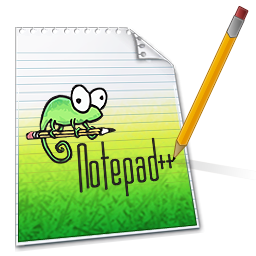

# Notepad++ for Linux (Native Qt Edition) 🦎

Orijinal [Notepad++](https://github.com/notepad-plus-plus/notepad-plus-plus) kaynak kodları, ikonları, renk temaları ve dil dosyaları referans alınarak Linux işletim sistemleri için geliştirilmiş, yüksek performanslı ve yerel (native) kod ve metin düzenleyici.



---

## 🌟 Öne Çıkan Özellikler

### 📝 1. Gelişmiş Kod ve Metin Düzenleyici
- **Özelleştirilmiş Sol Kenar (Gutter)**:
  - Satır numaraları ve aktif satır vurgusu.
  - **Yer İmleri (Bookmarks)**: Mavi parlak daire ikonları. Tıklayarak veya `Ctrl+F2` ile yer imi ekleme, `F2` / `Shift+F2` ile hızlı gezinme.
  - **Kod Katlama (Folding)**: Fonksiyon, sınıf ve girintili blokları `[+]` ve `[-]` butonlarıyla açıp kapatma.
- **Sözcük Kaydırma (Word Wrap)** ve **Girinti Kılavuzları (Indent Guides)**.
- **Görünür Karakterler**: Boşluklar (nokta), Sekmeler (ok) ve Satır Sonu formatları (`[CRLF]`, `[LF]`).
- **Hızlı Düzenleme Kısayolları**:
  - Satırı Çoğalt: `Ctrl+D`
  - Satırı Yukarı/Aşağı Taşı: `Ctrl+Shift+Yukarı` / `Ctrl+Shift+Aşağı`
  - Geçerli Satırı Sil: `Ctrl+Shift+L`
  - Yorum Satırı Yap / Kaldır: `Ctrl+K` veya `Ctrl+Q`
  - Büyük Harf / Küçük Harf: `Ctrl+Shift+U` / `Ctrl+U`
  - Satırları Sırala (A-Z) & Sondaki Boşlukları Temizle.

### 📑 2. Çoklu Sekme ve Çift Görünüm (Dual View / Split Screen)
- Orijinal Notepad++ Sekme Çubuğu:
  - 💾 **Mavi Disket**: Kaydedilmiş dosya.
  - 🔴 **Kırmızı Disket**: Değiştirilmiş / kaydedilmemiş dosya.
  - 🔒 **Kilit Simgesi**: Salt okunur dosya.
- **Sekme Menüsü & Kısayollar**: Orta tuşla kapatma, Diğerlerini Kapat, Sağdakileri/Soldakileri Kapat, Dosya Konumunu Aç, Dosya Yolunu Kopyala.
- **Bölmeli Ekran (Split View)**:
  - *Diğer Görünüme Taşı (Move to Other View)*
  - *Diğer Görünüme Klonla (Clone to Other View - Eşzamanlı düzenleme)*

### 🔍 3. 4 Sekmeli Gelişmiş Arama & Değiştirme
- **Bul (Find)**: `Ctrl+F` (Sonraki `F3`, Önceki `Shift+F3`, Sayma)
- **Değiştir (Replace)**: `Ctrl+H` (Tekli Değiştir, Tümünü Değiştir)
- **Dosyalarda Bul (Find in Files)**: `Ctrl+Shift+F` (Klasörde filtreli ve alt dizinli arama)
- **İşaretle (Mark)**: Eşleşen sözcükleri tüm belgede fosforlu renklerle işaretleme.
- **Arama Modları**: Normal, Genişletilmiş (`\n`, `\r`, `\t`, `\0`), Düzenli İfade (Regex).

### 🌐 4. Karakter Kodlaması ve EOL Dönüştürücü
- Otomatik Kodlama Algılama (`UTF-8`, `UTF-8 with BOM`, `Turkish Windows-1254`, `ISO-8859-9`, `UTF-16 LE/BE`, `ANSI`, `ASCII`).
- Canlı Satır Sonu Dönüştürücü: `Windows (CR LF)` ⮀ `Unix (LF)` ⮀ `Macintosh (CR)`.
- 6 Bölmeli Durum Çubuğu (Satır/Sütun/Seçim, Uzunluk/Satır Sayısı, EOL, Kodlama, Dil, INS/OVR).

### 🎨 5. Temalar ve Stil Yapılandırıcı (Style Configurator)
- Orijinal Notepad++ Temaları:
  - `Classic Default`
  - `DarkModeDefault`
  - `Monokai`
  - `Bespin`
  - `Obsidian`
  - `Zenburn`
  - `Deep Black`
- Karanlık Mod Arayüzü (Koyu gri araç çubuğu, sekmeler ve menüler).
- Monospace yazı tipi ve boyut ayarları.

### 📌 6. Yan Paneller (Dock Widgets)
- **Belge Haritası (Document Map / Minimap)**: Gerçek zamanlı küçük harita ve tıklanabilir kaydırma.
- **Fonksiyon Listesi (Function List)**: Sınıf ve fonksiyonları ağaç görünümünde listeleme ve çift tıklamayla satıra atlama.
- **Çalışma Alanı Dosya Tarayıcısı (Folder as Workspace)**: Proje klasörünü ağaç yapısında yönetme.
- **Arama Sonuçları Paneli**: Dosyalarda bul sonuçları için alt panel.

### ⚡ 7. Makro ve Harici Komut Çalıştırma
- **Makro Motoru**: Kaydet (`Ctrl+Shift+R`), Durdur (`Ctrl+Shift+S`), Oynat (`Ctrl+Shift+P`), Çok Kez Çalıştır.
- **Harici Çalıştırma**: Python, Bash ve web sayfalarını doğrudan çalıştırma (`F5`).

---

## 🚀 Kurulum ve Çalıştırma

### Gereksinimler
- Python 3.8+
- PyQt5
- Pygments
- chardet
- Pillow

Ubuntu / Debian sistemlerde:
```bash
sudo apt update
sudo apt install python3-pyqt5 python3-pygments python3-chardet python3-pil
```

### Kurulum:
```bash
# Depoyu klonlayın:
git clone https://github.com/turkerpro/notepad-plus-plus-linux.git
cd notepad-plus-plus-linux

# Kurulum betiğini çalıştırın:
./install.sh
```

### Başlatma:
```bash
# Terminalden:
notepad-plus-plus
# veya
npp

# Belirli bir dosyayı açmak için:
npp dosya.py

# Belirli bir satırdan açmak için:
npp -n 42 dosya.py
```

---

## 📁 Proje Yapısı

```
notepad-plus-plus-linux/
├── npp_linux/
│   ├── core/              # Düzenleyici, Kodlama, Sözdizimi, Makro, Belge ve Oturum
│   ├── ui/                # Ana Pencere, Sekmeler, Araç Çubuğu, Durum Çubuğu, Arama, Yan Paneller
│   ├── resources/         # Orijinal NPP İkonları, XML Temaları, Türkçe/İngilizce Dil Tanımları
│   └── styles/            # Koyu/Açık Tema ve QSS Şablonları
├── bin/
│   └── notepad-plus-plus  # Çalıştırılabilir Binary / Betik
├── tests/                 # Kapsamlı Birim ve Entegrasyon Testleri
├── install.sh             # Masaüstü ve Sistem Entegrasyon Betiği
└── notepad-plus-plus.desktop # Linux Uygulamalar Menüsü Başlatıcısı
```

---

## ⚖️ Lisans
Bu proje, orijinal Notepad++ projesi gibi **GNU General Public License v3** altında sunulmaktadır.
Orijinal Notepad++ telif hakları Don HO <don.h@free.fr> ve Notepad++ katkıcılarına aittir.
